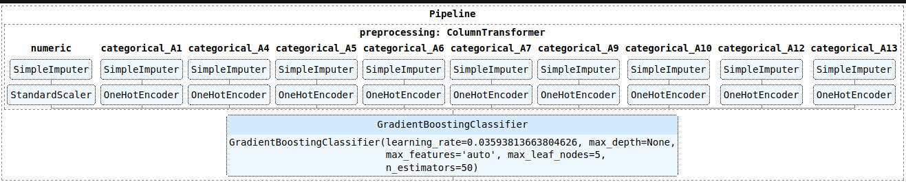
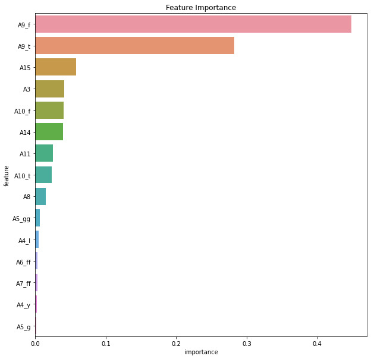
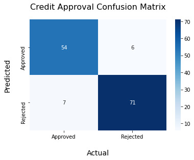
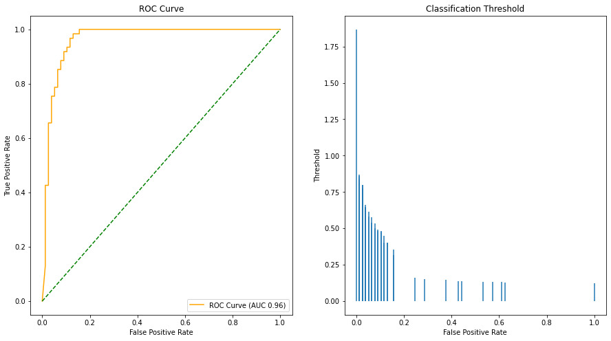

# Credit Approval Task [](https://colab.research.google.com/github/breathingcyborg/credit-approval/blob/main/credit-approval.ipynb)

There are many instant loan / instant credit mobile apps available in India. These app have to make quick decision if credit should be granted or denied. They recieve huge volume of applications daily, approval gets expensive soon which calls for automation.

# Data Privacy
The data contains credit card applications. All attribute names and values have been changed to meaningless symbols to protect the confidentiality of the data. This data is provided by [UCI](http://archive.ics.uci.edu/ml/datasets/credit+approval), we'll download it from [OpenML](https://www.openml.org/d/29).

# Business Objective & Evaluation Metric

Evaluation metric should align with business objectives. 

#### Objective 1: Avoid Bad Credit
* If business wants to approve credit only if its sure that it wont turn bad we could chose precision or false positive rate as our metric.

#### Objective 2: Get More Customers
* If business objective is customer aquisiton, we might grant credit even if we're not too sure if it will turn out to be bad, in this case we could use recall as our metric.

#### Business Objective: Bit of Both
* Acquiring new customers as well as preventing bad credit are important for business. Business wants some balance between these two. In this case we could use ROC-AUC or use f1 score as our metric.
* We'll maximize AUC, and use ROC-AUC Curve.

# Pipeline [](https://colab.research.google.com/github/breathingcyborg/credit-approval/blob/main/credit-approval.ipynb)

* All preprocessing steps and machine learning model are contained within this pipeline.
* Random Search with 5 fold cross validation was used to choose which model to use(RandomForest/SVM/etc) and its hyperparameters.



# Feature Importance
There are 15 features in original data, which increase to 46 after one hot encoding of categorical features. Only few of these features are important for the task.



# Results

### Confusion Matrix


### Summary
```
Area Under Curve  0.96
Accuracy          0.91
Precision         0.91
Recall            0.90
F1 Score          0.90
```

### ROC Curve

ROC Curve helps pick threshold to achive right balances between Objective1-Avoid Bad Credit and Objective2-Customer Acquisition.



### Classification Report
```
              precision    recall  f1-score   support

    Approved       0.90      0.89      0.89        61
    Rejected       0.91      0.92      0.92        77

    accuracy                           0.91       138
   macro avg       0.91      0.90      0.90       138
weighted avg       0.91      0.91      0.91       138
```
